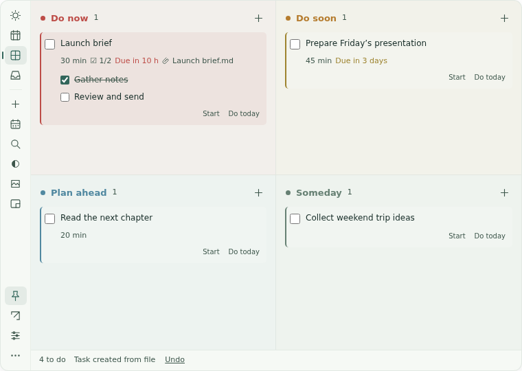
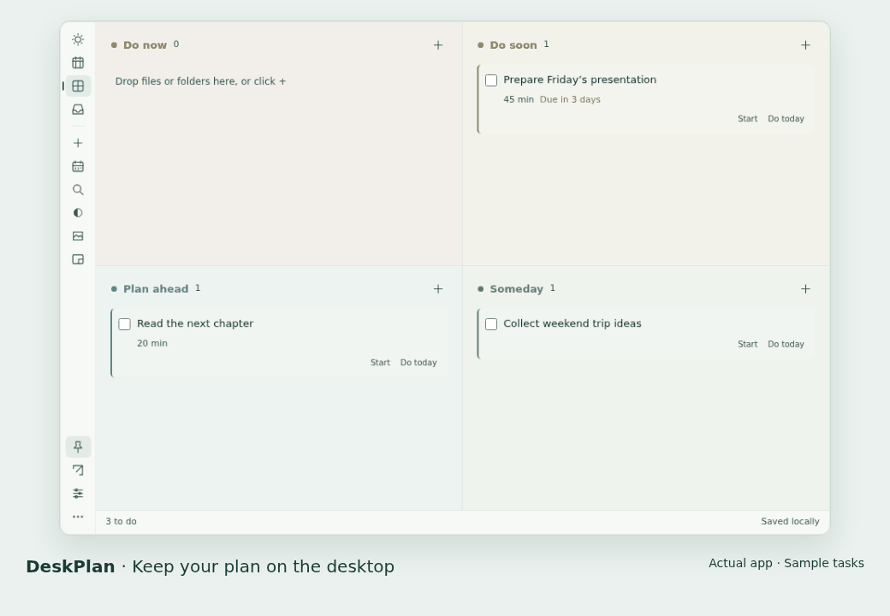

<p align="center"></p>
<h1 align="center">DeskPlan · 日序</h1>
<p align="center">Your plan, right on your desktop.</p>
<p align="center"><a href="README.md">简体中文</a> · <a href="https://asoming.github.io/deskplan/">Website & demo</a> · <a href="https://github.com/asoming/deskplan/releases/latest">Latest release</a> · <a href="https://github.com/asoming/deskplan/discussions">Discussions</a></p>
<p align="center"><a href="https://github.com/asoming/deskplan/releases/latest"></a> <a href="https://github.com/asoming/deskplan/actions/workflows/build.yml"></a>  <a href="LICENSE"></a></p>

Drop files into four urgency zones and plan Today or the Week. **Keep the planner above the desktop and below other apps, with separate background and text transparency.** No account. Works offline. No ads or telemetry.

## Download and try it

| System | Download v1.0.11 |
| --- | --- |
| Windows x64 | [EXE](https://github.com/asoming/deskplan/releases/download/v1.0.11/DeskPlan-1.0.11-windows-x64-setup.exe) |
| macOS Apple Silicon | [DMG](https://github.com/asoming/deskplan/releases/download/v1.0.11/DeskPlan-1.0.11-mac-arm64.dmg) |
| macOS Intel | [DMG](https://github.com/asoming/deskplan/releases/download/v1.0.11/DeskPlan-1.0.11-mac-x64.dmg) |
| Debian / Ubuntu x64 | [DEB](https://github.com/asoming/deskplan/releases/download/v1.0.11/DeskPlan-1.0.11-linux-x64.deb) |
| Linux x64 | [tar.gz](https://github.com/asoming/deskplan/releases/download/v1.0.11/DeskPlan-1.0.11-linux-x64.tar.gz) |

[All packages, SHA256 checksums and test reports](https://github.com/asoming/deskplan/releases/latest). Windows builds are unsigned; macOS builds are ad-hoc signed and not notarized. First-launch system prompts may appear. See the [installation guide](docs/INSTALL.en.md).



<details><summary>Watch the 15-second app demo: file → task → Today / Week → mini mode</summary>



Uses sample tasks only. [Open the website with playback controls](https://asoming.github.io/deskplan/#demo).

</details>

## A clear next step, on your desktop

| Feature | What it does |
| --- | --- |
| Four urgency zones | Now, Soon, Planned and Later use distinct colors. Soon tasks with ≤48 hours remaining automatically appear in Now |
| Today and Week | Pick Today’s top three. Drag tasks across the week and use time estimates to spot busy days. Planned dates stay separate from deadlines |
| Files and folders | Drop files, folders or project workspaces to create or attach tasks. Originals are never moved or uploaded |
| Quick capture | `Ctrl / ⌘ + Shift + Space` opens a small input; Enter saves to Inbox |
| Quiet presence | Corner docking, fixed position, sidebar controls on hover and mini mode. Tray-only presence; the panel appears at login |
| Local reliability | Checklists, recurring tasks, optional reminders, undo, trash, rolling backups and JSON / CSV export |

The four zones are priority tiers, not a two-axis importance/urgency matrix. For both text and background, **0% transparency is opaque; 100% is fully transparent**.

## Get started

1. Install and open the app. Click `+` or drop a file / folder into a task zone.
2. Add a planned date, deadline or checklist. Switch between Today, Week and the four zones.
3. Use Settings for transparency, language and reminders. Right-click the panel or tray to fix its position, open settings or quit.

**Data and updates:** tasks stay on your computer; attachment backups contain paths only. Existing data locations are retained. Versions 1.0.10 and earlier need one manual installation after the repository rename; install over the existing app without uninstalling. New versions can check and download updates in Settings; you choose when to install and restart.

## Feedback and contributions

- [Report a bug](https://github.com/asoming/deskplan/issues/new?template=bug_report.yml) · [Suggest a feature](https://github.com/asoming/deskplan/issues/new?template=feature_request.yml) · [Ask a question](https://github.com/asoming/deskplan/discussions)
- [Contribution guide](CONTRIBUTING.md) · [Roadmap](ROADMAP.md) · [Security reporting](SECURITY.md)
- [Product introduction](docs/INTRO.en.md) · [Feature history](docs/HISTORY.en.md) · [All release notes](https://github.com/asoming/deskplan/releases)

## Development

Node.js 22.12+ (CI uses 24), npm. Linux also needs a C++ compiler, make, Python 3 and libx11-dev.

```sh
npm ci
npm start
npm test
npm run test:desktop
npm run test:planner
npm run test:release
npm run test:language
```

[Testing and packaging](TESTING.md) · [Release process](docs/RELEASING.md) · [Website and demo maintenance](docs/WEBSITE.md). Native tests must use isolated data and displays, never personal tasks.

No cloud sync, team collaboration or two-way system calendar sync. Linux window behavior depends on the desktop environment and uses X11 / XWayland.

<a id="license"></a>
## License

Licensed under the [MIT License](LICENSE). Copyright (c) 2026 asoming. Use, modification, distribution and commercial use are permitted, provided the copyright and permission notices are retained in copies or substantial portions of the software. The software is provided “as is”, without warranty. Third-party components retain their respective licenses.
