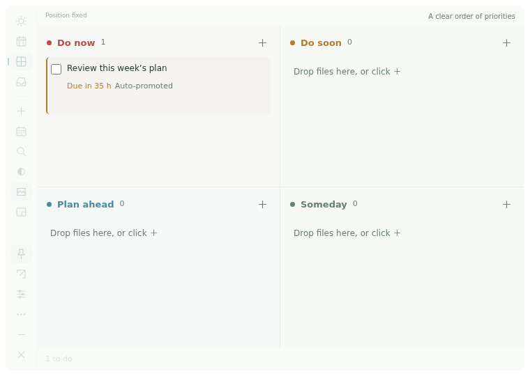

<p align="center"></p>
<h1 align="center">Rixu · 日序</h1>
<p align="center">Keep your plan on the desktop. Keep your attention on today.</p>
<p align="center"><a href="README.md">简体中文</a> · <a href="https://github.com/asoming/rixu/releases/latest">Download</a> · <a href="docs/INTRO.en.md">Introduction</a> · <a href="docs/RESEARCH.zh-CN.md">User research</a></p>

Rixu is a minimal, local-first desktop planner. Today, Week, four urgency zones and Inbox share the same tasks. Drop in files, plan your days, adjust transparency, and switch to a small panel that never stays on top when you want to focus.

No account. Works offline. No ads, telemetry, or background cloud synchronization. The app and documentation support Chinese and English. Open **Left sidebar settings icon → Settings and backup → 语言 / Language** to switch instantly. Your choice is remembered; your task content stays unchanged.



## Belong on the desktop

Desktop blend mode softens borders, shadows and large colored surfaces. Controls fade when idle and return on hover or keyboard focus. Background and text transparency are independent, each adjustable from 0–100%.

Mouse-through lock lets clicks reach the desktop or window beneath Rixu. Unlock with `Ctrl / Cmd + Shift + L` or the system tray. Lock is never restored on restart, and it cannot be enabled without a recovery route. Rixu remains a regular application window; it does not modify your wallpaper or Windows Explorer.

## Plan today and the week

| View | What it does |
| --- | --- |
| **Today** | Pick up to three priorities, drag to reorder, and estimate minutes; unfinished earlier plans remain clearly labeled |
| **Week** | Monday–Sunday columns with estimated workload and unestimated counts; flag days exceeding your chosen capacity |
| **Urgency zones** | Red: Now; amber: Soon; blue: Planned; sage: Later; drop real files to create or attach tasks |
| **Inbox** | Capture first, schedule later; global quick capture with `Ctrl / Cmd + Shift + Space` |
| **Mini window** | The current task and the next two, without staying on top; completed tasks are replaced automatically |

**Planned dates and deadlines are separate.** Dragging in Week changes the planned day. Dragging onto the deadline calendar changes the deadline. Soon tasks automatically appear in Now when no more than **48 hours** remain, and are reevaluated when rescheduled.

## Small features for daily friction

- **Recurring tasks:** daily, weekdays, weekly or monthly. Completion creates the next future occurrence, skipping missed dates instead of creating a backlog. A monthly 31st clamps to a shorter month’s end and returns to the 31st afterward.
- **Checklists:** up to 30 steps per task with progress on the card. A new recurrence resets its checklist.
- **Gentle reminders:** opt-in system notifications; defer, keep, cancel, or snooze for 30 minutes without changing the deadline. Reminders stop when the application is fully closed.
- **Local reliability:** atomic writes, undo, trash, seven rolling daily backups and a backup before restore.
- **Portable data:** full JSON backups and readable CSV export. Attachments are references to original files; backups do not include file contents and Rixu does not delete originals.

## Downloads

Get the matching asset from [GitHub Releases](https://github.com/asoming/rixu/releases/latest).

| Platform | Asset |
| --- | --- |
| Debian / Ubuntu x64 | `Rixu-1.0.2-linux-x64.deb` |
| Other Linux x64 | `Rixu-1.0.2-linux-x64.tar.gz` |
| Windows x64 | `Rixu-1.0.2-windows-x64-setup.exe` |
| macOS Apple Silicon | `Rixu-1.0.2-mac-arm64.dmg` or `.zip` |
| macOS Intel | `Rixu-1.0.2-mac-x64.dmg` or `.zip` |

Use the Windows installer, drag the macOS app into Applications, or install the Debian package with your software manager / `sudo apt install ./Rixu-1.0.2-linux-x64.deb`.

Release notes record actual build, test and signing status. Developer signing certificates are not configured: Windows builds are not Authenticode-signed; macOS builds are ad-hoc signed and not Apple-notarized. Operating-system checks may appear on first launch. Do not disable global operating-system security protections.

## Shortcuts

- Global capture: `Ctrl / Cmd + Shift + Space`; switch to `Alt + Shift + Space` in Settings if occupied.
- Mouse-through lock/unlock: `Ctrl / Cmd + Shift + L`.
- In-app new task / search / undo: `Ctrl / Cmd + N` / `F` / `Z`.
- Dismiss capture: `Esc`.

## Development

Node.js 22.12+ is required; CI uses Node.js 24.

```sh
npm ci
npm start
npm test
npm run test:desktop
npm run test:release
npm run test:language
npm run package:linux  # Linux host
npm run package:win    # Windows host
npm run package:mac    # macOS host
npm run test:package
```

Native UI tests require a desktop session. CI builds and tests Linux x64, Windows x64, macOS arm64 and macOS x64, retaining screenshots and test reports. See [Testing](TESTING.md) and [Releasing](docs/RELEASING.md).

For upgrades, the existing `四格` directory under the operating system’s application-data folder is intentionally retained. Schema 3 preserves older tasks, file paths and reminder records. Restore a compatible backup before downgrading. Tests use an isolated `RIXU_DATA_DIR`; never point tests at real user data.

## Scope

No accounts, cloud sync, collaboration, natural-language parsing or two-way system-calendar sync. Linux positioning and mouse-through depend on the window manager; Wayland users can try XWayland with `--ozone-platform=x11`. Automated native tests do not replace manual verification of every desktop environment, system permission or notification service.

Report problems in [Issues](https://github.com/asoming/rixu/issues). Source is publicly viewable; no open-source license is currently granted. Copyright remains with the author. Third-party components retain their respective licenses.

## Top-right docking and a fixed position (1.0.2)

Rixu starts at the top right of the screen work area with a 24 px margin; fresh installs use 760 × 540. Position is fixed by default while task editing and file drops remain available. Use the pin in the left sidebar to unlock, drag the top strip, then fix the position again. The diagonal arrow docks it at the top right. Settings can reserve an additional 0–480 px on the right. Mini mode keeps the same corner; manual placement is restored when expanded. Monitor changes keep the window in the available work area.

The main panel, mini panel and quick capture never stay on top. Legacy topmost preferences are disabled. Controls live in a narrow left sidebar with translated hover labels; the panel no longer shows a brand logo. The application launcher retains its icon.

Position locking does not pass clicks through. Mouse-through is a separate command. Rixu does not move desktop files and cannot automatically detect every desktop icon across operating systems. Use the right margin, manual position, mouse-through or hide the panel to make room. GUI tests run on an isolated display or in CI; updates do not automatically restart a working user instance.
