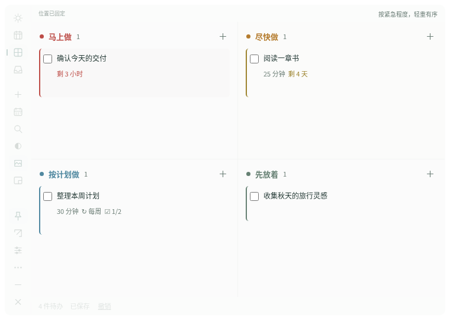

<p align="center"></p>
<h1 align="center">日序 · Rixu</h1>
<p align="center">让计划留在桌面，让注意力留给今天。</p>
<p align="center"><a href="README.en.md">English</a> · <a href="https://github.com/asoming/rixu/releases/latest">下载正式版</a> · <a href="docs/INTRO.zh-CN.md">产品介绍</a> · <a href="docs/RESEARCH.zh-CN.md">用户痛点调研</a></p>

日序是一个简洁、本地优先的桌面计划软件。今天、本周、紧急程度四象限和收集箱共用同一份任务；你可以拖入文件、安排日期、调整透明度，再把它缩成不会置顶的小窗。

无需账号，离线可用。没有广告、遥测或后台云同步。应用与文档都支持中文和英文。点击「左侧设置图标 → 设置与备份 → 语言 / Language」即可即时切换，选择会自动保存。任务、备注与文件名不会被翻译。



## 让桌面保持安静

点击工具栏「融入」，弱化边框、阴影和大块底色。闲置时工具栏淡出，鼠标移入或键盘聚焦时恢复。背景和文字透明度分别调整至 0–100%，背景完全透明时文字仍可保留。

右键面板可固定/解锁位置、打开设置或退出。解除固定后，拖动面板空白处或象限标题即可移动；不影响任务和文件拖放。

## 安排一天，也照顾一周

| 视图 | 用途 |
| --- | --- |
| **今天** | 手选最重要的 3 件事，拖动排序，标注预计耗时；未完成的往期计划保留并明确标记 |
| **本周** | 周一到周日看板；每日已估时与未估时数量；超出自定容量时提醒「偏满」 |
| **四象限** | 红色马上做、橙色尽快做、蓝色按计划做、灰绿先放着；拖入真实文件创建或关联任务 |
| **收集箱** | 想到就记，之后再安排；`Ctrl / ⌘ + Shift + 空格` 随手输入 |
| **小窗** | 当前任务和接下来两件；完成后自动补位 |

**计划日期与截止时间独立。** 本周拖动只调整打算哪天做；截止日历拖动才修改截止日期。尽快做的任务剩余不超过 **48 小时**时自动显示在马上做，改期后重新判断。

## 小功能，解决日常麻烦

- **重复任务**：每天、工作日、每周、每月。完成后生成下一次；晚完成会跳过已过去的日期，不堆出一串过期待办。每月 31 日遇短月会取月末，之后仍回到 31 日。
- **子清单**：每个任务最多 30 个步骤，卡片显示完成进度。重复任务的新一轮重置步骤状态。
- **温和提醒**：开启系统通知后按时提醒；延期、保留、取消，或 30 分钟后再提醒。稍后提醒不改截止时间。完全退出 App 后不提醒。
- **本地可靠性**：原子保存、撤销、回收站、最近 7 日滚动备份、恢复前另存当前数据。
- **带走数据**：JSON 完整备份与 CSV 表格导出。文件附件保存原路径，备份不包含附件内容，不会删除原文件。

## 下载

在 [GitHub Releases](https://github.com/asoming/rixu/releases/latest) 选择你的系统：

| 系统 | 文件 |
| --- | --- |
| Debian / Ubuntu，x64 | `Rixu-1.0.7-linux-x64.deb` |
| 其他 Linux，x64 | `Rixu-1.0.7-linux-x64.tar.gz` |
| Windows，x64 | `Rixu-1.0.7-windows-x64-setup.exe` |
| macOS，Apple Silicon | `Rixu-1.0.7-mac-arm64.dmg` 或 `.zip` |
| macOS，Intel | `Rixu-1.0.7-mac-x64.dmg` 或 `.zip` |

Windows 使用安装向导；macOS 把 App 拖入 Applications；Debian/Ubuntu 可使用软件安装器或 `sudo apt install ./Rixu-1.0.7-linux-x64.deb`。

发行说明会记录实际构建、测试及签名状态。本项目尚未配置开发者代码签名证书：Windows 安装程序未做 Authenticode 签名，macOS 使用临时签名，未进行 Apple 公证。首次打开可能受到系统检查；这与安装包能否构建、应用能否运行是不同的验证项。不要关闭系统的全局安全保护。

## 快捷键

| 操作 | 快捷键 |
| --- | --- |
| 全局随手记录 | `Ctrl / ⌘ + Shift + 空格`，冲突时在设置中切换 `Alt + Shift + 空格` |
| 新任务 / 搜索 / 撤销 | App 内 `Ctrl / ⌘ + N` / `F` / `Z` |
| 收起随手记 | `Esc` |

## 开发与验证

需要 Node.js 22.12+（CI 使用 24）和 npm。Linux 源码构建还需 C++ 编译器、make、Python 3 与 libx11-dev；安装包不需要开发工具。

```sh
npm ci
npm start
npm test
npm run test:desktop
npm run test:release
npm run test:language
npm run package:linux  # 在 Linux
npm run package:win    # 在 Windows
npm run package:mac    # 在 macOS
npm run test:package   # 运行刚打包的 App
```

原生界面测试需要桌面会话。CI 使用四个系统/架构环境执行测试和构建；Linux 使用 Xvfb 与窗口管理器。每次构建保存安装包、界面截图及测试报告。[测试说明](TESTING.md) · [发行流程](docs/RELEASING.md)

旧版用户沿用系统应用数据目录下的 `四格` 文件夹，升级保留任务、附件路径和提醒记录。数据格式升级至 schema 3；回退旧版前请恢复对应版本的备份。测试通过 `RIXU_DATA_DIR` 指向独立目录，禁止指向真实数据。

## 范围

暂不包含账号、云同步、团队协作、自然语言解析和系统日历双向同步。Linux 桌面定位依赖窗口管理器，通过 X11/XWayland 运行。多系统构建和自动化测试不替代每个桌面环境、系统权限和通知服务的人工验证。

反馈请使用 [Issues](https://github.com/asoming/rixu/issues)。源代码公开可供查看；当前未授予开源许可证，版权归作者所有。第三方组件适用各自许可证。

## 右上角停靠与固定位置（1.0.2）

默认紧贴屏幕可用区域右上角，窗口与可见面板均不留外侧空隙；新安装默认 760 × 540。固定位置默认开启，任务编辑、勾选和文件拖放照常工作。左侧图钉可解锁，拖动左侧图标栏空白处后再固定；斜向箭头可回到右上角，同时将右侧留白设为 0。设置中的「右侧留白」可额外预留 0–480 像素。切换小窗后继续贴靠右上角，手动位置在展开时恢复。显示器移除或分辨率变化时保持在可用区域内。

主面板、小窗和随手记均不设为置顶，其他应用可以正常盖住日序。旧备份中的置顶选项会被关闭。功能入口集中到左侧小图标栏，悬停显示当前语言的名称；面板内不再显示品牌图标。应用启动器图标继续用于找到和打开软件。

固定位置只禁止移动，不影响任务和文件拖放。小窗只显示新建和展开两个工具按钮，其余入口放在右键菜单。测试使用隔离显示或 CI，本机更新遵循用户授权的先备份、先安装流程。

1.0.3 移除顶部状态文字、说明文字及整行占位；解锁拖动区改到左侧栏空白处。贴边仍避开系统菜单栏与任务栏。

## 1.0.4 桌面底层与工作目录

主面板和小窗固定在普通应用窗口下方，点击、聚焦或打开任务不会把面板抬到工作窗口上面。Linux 使用高于桌面图标、低于普通应用的交互层；macOS 使用原生 desktop 类型，Windows 在窗口排序变更应用前保持底层。用户主动打开的随手记和系统文件选择器是临时交互窗口。

支持将文件夹、项目目录或 `.code-workspace` 文件拖入四象限，或拖到已有任务上关联。目录名保留完整名称（包含点号），附件显示文件夹图标；点目录名可在文件管理器打开。编辑器另有「添加文件夹」，移动目录后可重定位。仅保存路径，不递归扫描或复制目录；完成、删除或清空任务不会删除原目录。

## 1.0.5 点击与拖放修复

修复 Linux 下桌面图标窗口挡住日序，造成按钮无法点击、文件落到后方桌面的问题。层级明确为：桌面/图标 < 日序 < 普通应用。背景 100% 透明仍接收操作；固定位置只限制移动，不启用鼠标穿透。Linux 通过 X11/XWayland 运行。

## 1.0.6 简化操作与更新提示

移除鼠标穿透功能、快捷键以及最小化/关闭按钮。解除固定后，拖动空白处或象限标题移动；小窗只有 ＋ 和展开两个按钮，固定位置、设置和退出在右键菜单。

启动后与运行中每 6 小时检查 GitHub 正式版本。新版本提示在用户回到日序且没有编辑对话框时出现，同一版本自动提示一次；设置 → 软件更新可随时检测、重试或关闭自动检查。仅提供版本提示和 GitHub 下载入口，不自动安装、不上传任务与文件。API 限流时使用 GitHub 官方最新版链接备用检测。

## 1.0.7 应用内下载与安装

设置 → 软件更新 → 检测更新 → 下载更新。显示下载进度，支持取消和重试；SHA256 校验通过后出现「安装并重启」。也可稍后安装，已下载的更新包会保留到下次启动。安装前额外备份任务与设置，随手记草稿也会保留。不会后台自动下载、安装或强制重启。

Linux 用户目录安装可直接替换并保留旧版本；系统 deb 安装通过系统授权安装。Windows 使用原有安装目录更新；macOS 从已安装的 Applications 应用更新并验证签名完整性。安装目录需要可写；不可写时可从 GitHub 下载手动安装。macOS 临时签名不等于开发者身份认证或公证。1.0.6 及更早版本需要手动安装一次本版本，之后可使用应用内更新。
