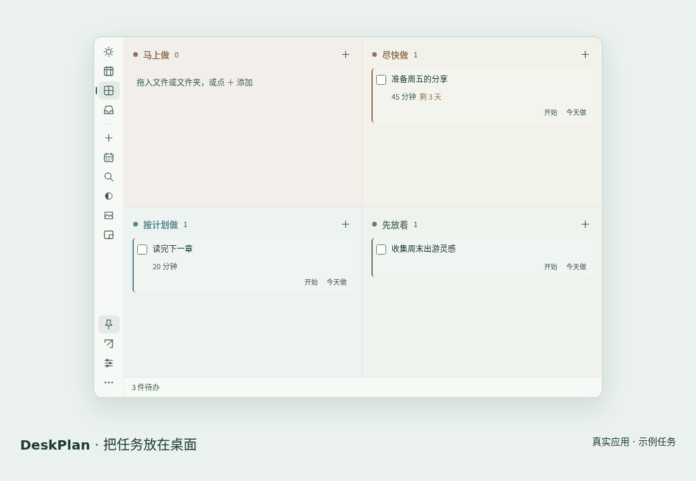

<p align="center"></p>
<h1 align="center">日序 · DeskPlan</h1>
<p align="center">让计划留在桌面，让注意力留给今天。</p>
<p align="center"><a href="README.en.md">English</a> · <a href="https://asoming.github.io/deskplan/zh-CN/">产品主页与演示</a> · <a href="https://github.com/asoming/deskplan/releases/latest">最新正式版</a> · <a href="https://github.com/asoming/deskplan/discussions">交流与建议</a></p>
<p align="center"><a href="https://github.com/asoming/deskplan/releases/latest"></a> <a href="https://github.com/asoming/deskplan/actions/workflows/build.yml"></a>  <a href="LICENSE"></a></p>

把文件拖进四象限，安排今天与本周。**背景和文字透明度独立可调，留在桌面上，低于其他应用。** 无需账号，离线可用，没有广告与遥测。

## 下载与体验

| 系统 | 下载 v1.0.11 |
| --- | --- |
| Windows x64 | [EXE](https://github.com/asoming/deskplan/releases/download/v1.0.11/DeskPlan-1.0.11-windows-x64-setup.exe) |
| macOS Apple Silicon | [DMG](https://github.com/asoming/deskplan/releases/download/v1.0.11/DeskPlan-1.0.11-mac-arm64.dmg) |
| macOS Intel | [DMG](https://github.com/asoming/deskplan/releases/download/v1.0.11/DeskPlan-1.0.11-mac-x64.dmg) |
| Debian / Ubuntu x64 | [DEB](https://github.com/asoming/deskplan/releases/download/v1.0.11/DeskPlan-1.0.11-linux-x64.deb) |
| Linux x64 | [tar.gz](https://github.com/asoming/deskplan/releases/download/v1.0.11/DeskPlan-1.0.11-linux-x64.tar.gz) |

[全部安装包、SHA256 校验和与测试报告](https://github.com/asoming/deskplan/releases/latest)。Windows 尚未签名，macOS 使用临时签名且未公证；首次打开可能出现系统提示。详见[安装说明](docs/INSTALL.zh-CN.md)。


<details><summary>观看 15 秒真实应用演示：文件 → 任务 → 今天 / 本周 → 小窗</summary>



演示仅使用示例任务；[打开可控制播放的产品页](https://asoming.github.io/deskplan/zh-CN/#demo)。

</details>

## 做好桌面上的下一步

| 功能 | 怎么用 |
| --- | --- |
| 四象限 | 马上做、尽快做、按计划做、先放着，各自使用不同颜色；尽快做剩余 ≤48 小时会自动显示在马上做 |
| 今天与本周 | 今天挑出最重要的 3 件事；拖动安排一周，用预计耗时发现哪天太满。计划日期和截止日期独立 |
| 文件与文件夹 | 拖入创建任务或关联已有任务，也支持项目工作空间；保存原路径，不移动或上传原文件 |
| 随手记 | `Ctrl / ⌘ + Shift + 空格` 呼出输入框，回车保存到收集箱 |
| 安静常驻 | 右上角停靠、固定位置、鼠标停留才显示侧栏、小窗；托盘常驻，开机显示，不占任务栏 |
| 本地可靠性 | 子清单、重复任务、可选提醒、撤销、回收站、滚动备份与 JSON / CSV 导出 |

四象限采用四档处理优先级，不是“重要 × 紧急”的双轴矩阵。背景与文字透明度均为 **0% 不透明、100% 全透明**。

## 开始使用

1. 安装并启动，点 `＋` 或将文件 / 文件夹拖入任务区。
2. 安排计划日期、截止时间或子清单；在今天、本周、四象限之间切换。
3. 左侧设置中调整透明度、语言与提醒。右键面板或托盘可固定位置、打开设置或退出。

**本地数据与更新：** 任务保存在本机，附件备份只包含路径。旧版本沿用原数据目录；1.0.10 及以前因仓库改名需手动覆盖安装一次新版，无需卸载。之后可在设置里检测、下载更新，自行选择安装重启。

## 反馈与参与

- [报告问题](https://github.com/asoming/deskplan/issues/new?template=bug_report.yml) · [建议功能](https://github.com/asoming/deskplan/issues/new?template=feature_request.yml) · [交流使用方法](https://github.com/asoming/deskplan/discussions)
- [参与指南](CONTRIBUTING.md) · [后续方向](ROADMAP.md) · [安全反馈](SECURITY.md)
- [产品介绍](docs/INTRO.zh-CN.md) · [历史功能更新](docs/HISTORY.zh-CN.md) · [全部发行说明](https://github.com/asoming/deskplan/releases)

## 开发

Node.js 22.12+（CI 使用 24），npm；Linux 还需 C++ 编译器、make、Python 3 与 libx11-dev。

```sh
npm ci
npm start
npm test
npm run test:desktop
npm run test:planner
npm run test:release
npm run test:language
```

[完整测试与打包](TESTING.md) · [发行流程](docs/RELEASING.md) · [网站与演示维护](docs/WEBSITE.md)。原生测试必须使用隔离数据与桌面，不能使用个人任务数据。

当前不提供云同步、团队协作或系统日历双向同步。Linux 窗口行为依赖桌面环境，使用 X11 / XWayland。

<a id="license"></a>
## 许可

本项目采用 [MIT 许可证](LICENSE)，Copyright (c) 2026 asoming。允许使用、修改、分发和商用；复制或分发本软件或其重要部分时，需保留版权声明与许可声明。软件按“原样”提供，不作担保。第三方组件遵循各自许可证。
